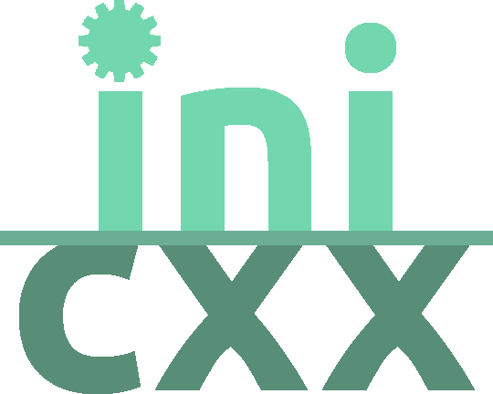

	
	
A simple, single-header INI file parser library for C++

	
	
	
	   

An INI file is a text-based configuration file with key-value pairs and sections,
[click here](https://en.wikipedia.org/wiki/INI_file) to read more.

## Features
- Trailling comments
- Writing and reading
- Header-only
- Exceptions are optional
- Default section
- Conversion functions
- Support for both `;` and `#` comments

## Library usage
Since it is a single header library, just include the header file `inicxx.hh` in your project and you are ready
to use it.

## Examples
You can find example files which have all the features explained under the `examples/` folder

#### Compiling
To compile the examples, run `make` in the `examples/` folder which will create binaries in the `bin/` folder.

## Make
Use `make all` to see all the make targets.

### Compiling
Run `make` or `make compile` to compile the examples. This will create binaries in the `bin/` folder.

> If you want to change the compiler make uses, set the `CXX` variable. Example: `make CXX=g++`
